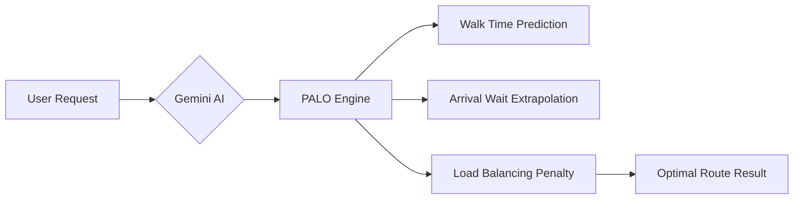

# SwiftSeat — Smart Venue Experience Assistant 🏟️

[](https://github.com/seeramsujay/swiftSeat/actions/workflows/mobile-build.yml)
[](https://github.com/seeramsujay/swiftSeat/releases)

A dynamic, cross-platform intelligent system designed to revolutionize the attendee experience at large-scale sporting events using the **PALO Algorithm** and **Gemini AI**.

---

## 🚀 The Vision
SwiftSeat addresses the critical logistical challenges of modern stadiums: crowd congestion, concession wait times, and emergency response. By integrating Google Cloud Services and a predictive routing algorithm, we provide fans with a **seamless, frictionless journey** from entry to exit.

## 📱 Platforms
*   **Mobile App (Recommended)**: Built with **Expo/React Native**. Experience the "Kinetic Oasis" design system.
    *   👉 **[Download Latest APK](https://github.com/seeramsujay/swiftSeat/releases)**
*   **Web Console**: Built with **Vite/React**. For administrative and stadium management views.

## 🧠 Core Innovation: The PALO Algorithm
**Predictive Arrival-time, Load-balanced Optimization** — our routing engine doesn't just find the *currently* fastest concession stand. It predicts wait times at your **arrival time**, factoring in walk distance and global load balancing.



## 🎨 Design System: "Kinetic Oasis"
*   **Atmospheric Navigator**: Deep midnight palette (`#10141a`) optimized for stadium-glare legibility.
*   **Glassmorphism**: 20px background blurs for depth and tactile feedback.
*   **No-Line Rule**: Tonal layering instead of 1px borders for a premium, integrated feel.

## 📂 Repository Structure
*   `mobile/` — React Native (Expo) mobile application.
*   `src/` — React (Vite) web console.
*   `backend/` — Python-based telemetry simulation and Gemini proxy.
*   `Archives/` — Technical specifications and research.

## 🛠️ Setup & Development

### Mobile (Expo)
```bash
cd mobile
npm install
npx expo start
```
*Scan the QR code with **Expo Go** to test on a physical device.*

### Web (Vite)
```bash
npm install
npm run dev
```

## 📜 Accessibility & Inclusion
*   **Step-free Routing**: Prioritizes mobility-accessible paths.
*   **High-Glare UX**: WCAG 2.1 AA compliant contrast ratios.
*   **TTS Integration**: Narrated directions for visually impaired fans.

---
*Created for the Prompt Wars Hackathon — Revolutionizing Venue Logistics.*
